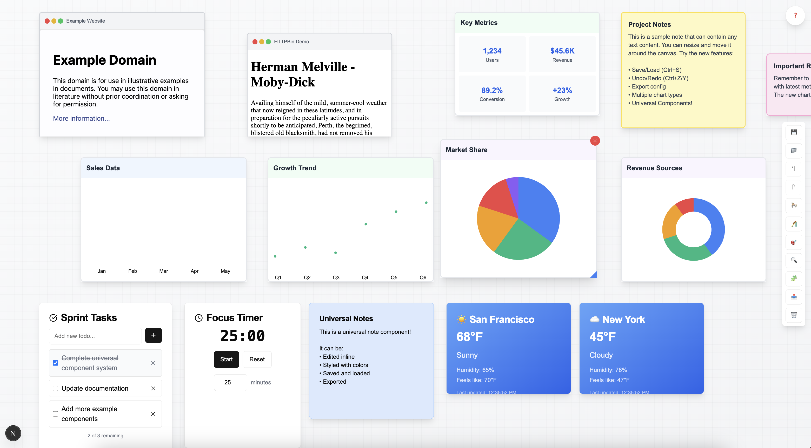
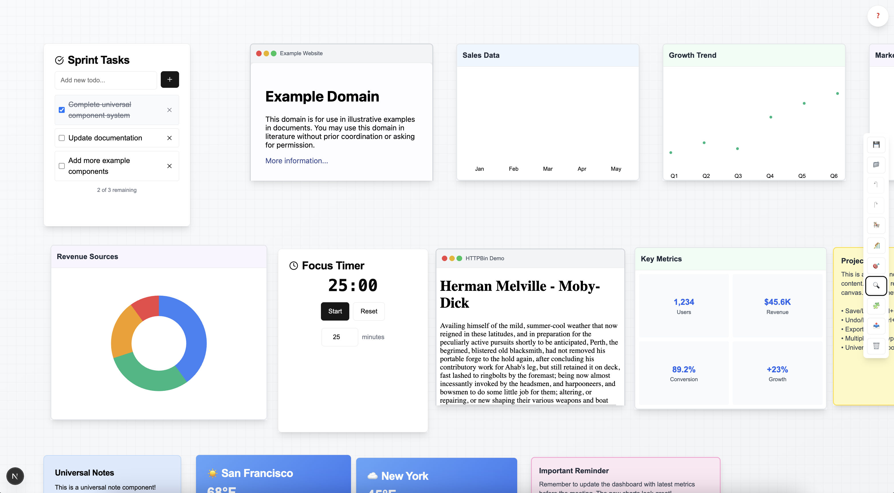
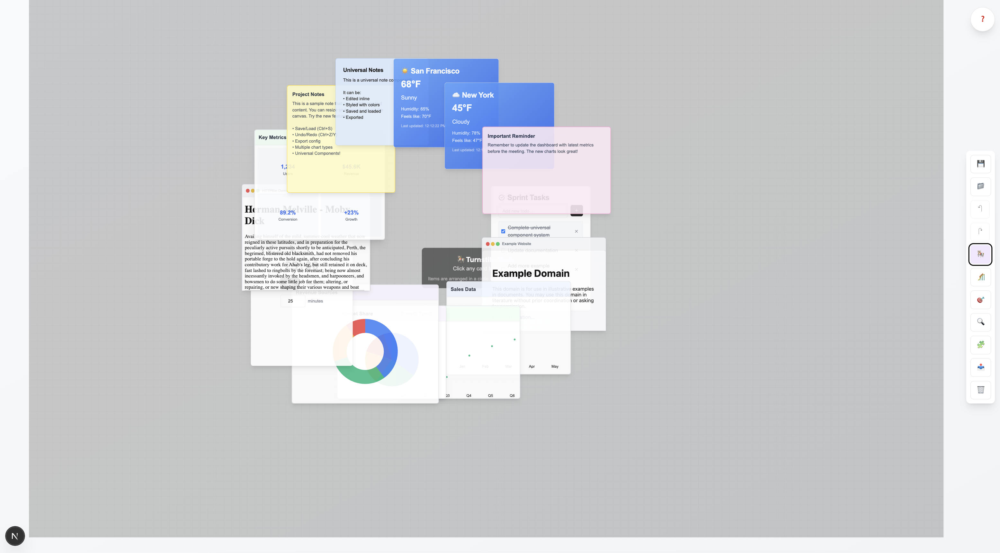
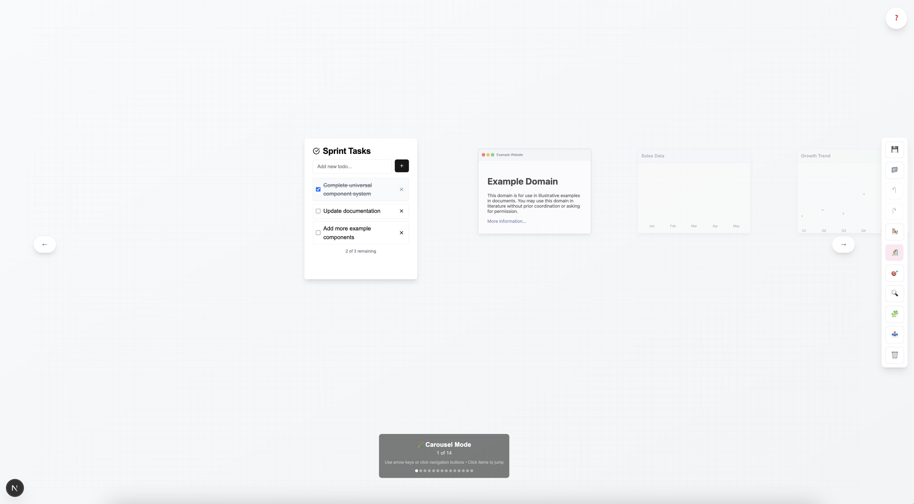

# Draggable Canvas - Interactive Dashboard Builder

A powerful, data-driven canvas component for creating interactive dashboards with draggable, resizable components.

## 🎨 Visual Showcase

### Main Dashboard View

*The main canvas with various components: charts, notes, websites, and universal components all arranged on an infinite scrollable canvas.*

### Auto-Layout Feature

*Click the 🧩 Auto-Layout button to instantly organize all components in a structured grid pattern.*

### Auto-Fit Zoom

*The 🎯 Auto-Fit feature automatically zooms to show all components in the viewport.*

### Turnstile Mode

*🎠 Turnstile mode arranges overlapping components in a circular pattern for easy navigation.*

### Carousel Mode  

*🎢 Carousel mode provides linear navigation through your components with smooth transitions.*

### Interactive Features

*Drag, resize, and delete components with intuitive controls. Live website embedding and editable components.*

## 🚀 Features

### Core Functionality
- **Drag & Drop**: Move components freely around the canvas
- **Resize**: Drag corners to resize any component
- **Delete**: Remove components with hover controls
- **Data-Driven**: Configure content via JSON configuration

### Advanced Features
- **Save/Load**: Persist canvas layouts to localStorage
- **Undo/Redo**: Full history tracking with keyboard shortcuts
- **Export**: Download canvas configuration as JSON
- **Keyboard Shortcuts**: Professional workflow support
- **Multiple Chart Types**: Bar, Line, Pie, Donut, and Metrics
- **Rich Notes**: Colored sticky notes with text content
- **Live Websites**: Embed and interact with external websites
- **Turnstile Mode**: Circular arrangement for managing overlapping cards
- **Enhanced Tooltips**: Informative hover tooltips with keyboard shortcuts

## 🚀 Getting Started

### Quick Setup
1. **Clone the repository**
   ```bash
   git clone https://github.com/your-username/draggable-canvas.git
   cd draggable-canvas
   ```

2. **Install dependencies**
   ```bash
   npm install
   ```

3. **Run development server**
   ```bash
   npm run dev
   ```

4. **Open your browser**
   Navigate to [http://localhost:3000](http://localhost:3000)

## 📚 How to Use

### Method 1: Run the Demo Application

The easiest way to get started is to run the included demo:

```bash
npm run dev
```

This will show you a full-featured dashboard with:
- Sample charts (bar, line, pie, metrics)
- Sticky notes with different colors
- Live website embeds
- All interactive features working

### Method 2: Use as a Component Library

#### Basic Integration

```tsx
import { DynamicCanvas } from './app/page'

function MyApp() {
  return (
    <div>
      <h1>My Dashboard</h1>
      <DynamicCanvas />
    </div>
  )
}
```

#### With Custom Configuration

```tsx
import { DynamicCanvas } from './app/page'

function MyDashboard() {
  const dashboardConfig = {
    charts: [
      {
        type: "bar",
        title: "Monthly Sales",
        data: {
          values: [120, 190, 300, 500, 200],
          labels: ["Jan", "Feb", "Mar", "Apr", "May"]
        },
        x: 50,
        y: 100,
        width: 400,
        height: 300
      }
    ],
    notes: [
      {
        title: "Team Notes",
        content: "Remember to review Q1 results",
        color: "yellow",
        x: 500,
        y: 100,
        width: 300,
        height: 200
      }
    ],
    urls: [
      {
        url: "https://github.com",
        title: "GitHub",
        x: 100,
        y: 450,
        width: 600,
        height: 400
      }
    ]
  }

  return <DynamicCanvas config={dashboardConfig} editable={true} />
}
```

### Method 3: Customize and Build Your Own

#### Step 1: Create Your Data

```javascript
// data/dashboard-config.js
export const myDashboardConfig = {
  charts: [
    // Bar Chart Example
    {
      type: "bar",
      title: "Revenue by Quarter",
      data: {
        values: [25000, 32000, 28000, 35000],
        labels: ["Q1", "Q2", "Q3", "Q4"]
      },
      x: 50,
      y: 50,
      width: 350,
      height: 250
    },
    
    // Line Chart Example
    {
      type: "line", 
      title: "User Growth",
      data: {
        values: [100, 150, 120, 280, 350, 400],
        labels: ["Jan", "Feb", "Mar", "Apr", "May", "Jun"]
      },
      x: 450,
      y: 50,
      width: 350,
      height: 250
    },
    
    // Pie Chart Example
    {
      type: "pie",
      title: "Market Share",
      data: {
        values: [35, 25, 20, 15, 5],
        labels: ["Product A", "Product B", "Product C", "Product D", "Others"]
      },
      x: 50,
      y: 350,
      width: 300,
      height: 300
    },
    
    // Metrics Dashboard
    {
      type: "metrics",
      title: "Key Performance Indicators",
      data: {
        metrics: [
          { label: "Total Users", value: "12,345" },
          { label: "Revenue", value: "$125.6K" },
          { label: "Conversion Rate", value: "3.2%" },
          { label: "Active Sessions", value: "1,892" }
        ]
      },
      x: 450,
      y: 350,
      width: 350,
      height: 200
    }
  ],
  
  notes: [
    {
      title: "Project Goals",
      content: "1. Increase user engagement by 25%\n2. Launch new feature by Q2\n3. Improve conversion rate",
      color: "blue",
      x: 850,
      y: 50,
      width: 300,
      height: 250
    },
    {
      title: "Team Meeting Notes",
      content: "Discussed quarterly targets and resource allocation for upcoming projects.",
      color: "green", 
      x: 850,
      y: 350,
      width: 300,
      height: 200
    }
  ],
  
  urls: [
    {
      url: "https://analytics.google.com",
      title: "Google Analytics",
      x: 50,
      y: 700,
      width: 500,
      height: 350
    },
    {
      url: "https://github.com/your-repo",
      title: "Project Repository", 
      x: 600,
      y: 700,
      width: 500,
      height: 350
    }
  ]
}
```

#### Step 2: Create Your Dashboard Component

```tsx
// components/MyDashboard.tsx
import { DynamicCanvas } from '../app/page'
import { myDashboardConfig } from '../data/dashboard-config'

export default function MyDashboard() {
  const handleItemsChange = (items) => {
    console.log('Canvas items changed:', items)
    // Save to database, localStorage, etc.
  }

  return (
    <div className="w-full h-screen">
      <header className="bg-gray-100 p-4 border-b">
        <h1 className="text-2xl font-bold">My Business Dashboard</h1>
      </header>
      
      <DynamicCanvas 
        config={myDashboardConfig}
        editable={true}
        onItemsChange={handleItemsChange}
      />
    </div>
  )
}
```

## 🎮 Interactive Controls

### Keyboard Shortcuts
- `Ctrl/Cmd + S` - Save canvas to localStorage
- `Ctrl/Cmd + Z` - Undo last action
- `Ctrl/Cmd + Y` - Redo last undone action  
- `Delete` - Remove selected items

### Mouse Controls
- **Drag**: Click and drag any component to move it
- **Resize**: Drag the blue triangle in bottom-right corner
- **Delete**: Click the red X button that appears on hover
- **Select**: Click on components to select them

### Toolbar Features

| Button | Function | Description |
|--------|----------|-------------|
| 💾 | Save Canvas | Saves current layout to browser storage |
| 📁 | Load Canvas | Loads previously saved layout |
| ↶ | Undo | Undo last change |
| ↷ | Redo | Redo last undone change |
| 🎠 | Turnstile Mode | Arrange items in a circle for easy viewing |
| 📤 | Export Config | Download canvas configuration as JSON |
| 🗑️ | Clear Canvas | Remove all items from canvas |

## 📊 Chart Configuration Guide

### Bar Charts
Perfect for comparing values across categories:

```javascript
{
  type: "bar",
  title: "Sales by Region",
  data: {
    values: [120, 190, 300, 500, 200],
    labels: ["North", "South", "East", "West", "Central"]
  },
  x: 100,      // X position on canvas
  y: 100,      // Y position on canvas  
  width: 400,  // Chart width
  height: 300  // Chart height
}
```

### Line Charts
Great for showing trends over time:

```javascript
{
  type: "line",
  title: "Monthly Revenue Trend",
  data: {
    values: [1000, 1500, 1200, 2800, 3500, 4200],
    labels: ["Jan", "Feb", "Mar", "Apr", "May", "Jun"]
  },
  x: 100,
  y: 100,
  width: 450,
  height: 250
}
```

### Pie/Donut Charts
Ideal for showing proportions:

```javascript
{
  type: "pie", // or "donut"
  title: "Budget Allocation",
  data: {
    values: [40, 25, 20, 10, 5],
    labels: ["Marketing", "Development", "Sales", "Support", "Other"]
  },
  x: 100,
  y: 100,
  width: 350,
  height: 350
}
```

### Metrics Dashboard
Display key performance indicators:

```javascript
{
  type: "metrics",
  title: "Business Metrics",
  data: {
    metrics: [
      { label: "Monthly Revenue", value: "$45,200" },
      { label: "New Customers", value: "127" },
      { label: "Conversion Rate", value: "12.5%" },
      { label: "Customer Satisfaction", value: "4.8/5" }
    ]
  },
  x: 100,
  y: 100,
  width: 400,
  height: 250
}
```

## 📝 Notes Configuration

Create sticky notes with different colors and content:

```javascript
{
  title: "Meeting Notes",
  content: "Key discussion points:\n• Q4 targets exceeded\n• New product launch planned\n• Team expansion needed",
  color: "yellow", // Options: yellow, blue, green, pink, purple
  x: 100,
  y: 100,
  width: 300,
  height: 250
}
```

### Available Colors
- **yellow**: Classic sticky note color
- **blue**: Professional, calming
- **green**: Success, positive notes  
- **pink**: Important, attention-grabbing
- **purple**: Creative, brainstorming

## 🌐 Website Embedding

Embed live, interactive websites directly in your dashboard:

```javascript
{
  url: "https://example.com",
  title: "Live Website Preview",
  x: 100,
  y: 100,
  width: 600,
  height: 400
}
```